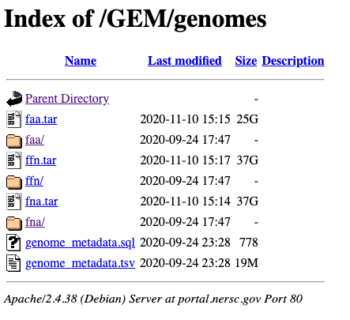

Last month a new shiny database was born for the joy and desesperation of all the microbiologists interested in MAGs. The Genomic catalog of Earth Microbiomes (GEM db) is one of the most comprehensive datasets right now regarding the diversity of bacteria and archaea. The GEMdb expanded the known phylogenetic diversity of bacteria and archaea by 44% and it is available for all kind of analyses. Since I was interested in solely my subject of study, here I will show how I downloaded all the MAGs i was interested.

First of all, by going to the [paper data availability](https://www.nature.com/articles/s41587-020-0718-6#data-availability) we see that there are various options for downloading.

By going to the NERSC portal and clicking to genomes, we observe various files:

We will retrieve the `genome_metadata.tsv`. If you click with the right in the mouse you can copy the link directly.

    # we make a directory to save all the data
    mkdir gem_db_subset
    cd gem_db_subset/
    wget  https://portal.nersc.gov/GEM/genomes/genome_metadata.tsv

To check the file I used Wei Shen [csvtk](https://github.com/shenwei356/csvtk). It is a useful command-line tool to work both with csv and tsv. Yup, it is yet *another* tool to do things, maybe unnecessary. But I think it makes way easier some processes. Sorry not sorry ;^)

    # We discover the headers for each column
    csvtk headers -t genome_metadata.tsv

    # We check the first values for some of the headers we are interested
    csvtk cut -f completeness,ecosystem_type,taxonomy  -t genome_metadata.tsv  | csvtk head

We are specifically interested in **high quality genomes** coming from a **marine ecosystem.** To check how it is specified "marine" in this `tsv` we will check it with a grep

    csvtk cut -f completeness,ecosystem_type,taxonomy  -t genome_metadata.tsv  | grep 'arine'

Having a clear picture, we just have to filter all the results to keep only the genomes of interest. Get out, soil people.

    csvtk filter -f "completeness>=70" -t genome_metadata.tsv | csvtk grep -t  -p Marine -f ecosystem_type > marine_mags_gemdb.tsv

And now we want to retrieve each of the genome files in the db. Each genome is stored with:

-   `faa`: the aminoacidic sequences.

-   `fna`: the nucleotide contigs, without annotating, just the raw sequences.

-   `ffn`: the annotation of the faa sequences in nucleotides.

We could download all the genomes and then filter out the ones we are interested, but a more elegant way is to search specifically each genome and afterwards tidy all the data. The NSERC portal makes it easy with the directories, `faa/`, `fna/` and `ffn/`.

We therefore iterate through a loop and get each of the sequences separately.

    for genome_name in $(cut -f1,1 marine_mags_gemdb.tsv );
    do
        wget https://portal.nersc.gov/GEM/genomes/faa/${genome_name}.faa.gz;
        wget https://portal.nersc.gov/GEM/genomes/fna/${genome_name}.fna.gz;
        wget https://portal.nersc.gov/GEM/genomes/ffn/${genome_name}.ffn.gz;

    done;

    mkdir faa
    mkdir fna
    mkdir ffn

    mv *.faa.gz faa/.
    mv *.fna.gz fna/.
    mv *.ffn.gz ffn/.

And voilà!

A new dataset to play with.

I hope you find it useful :)
